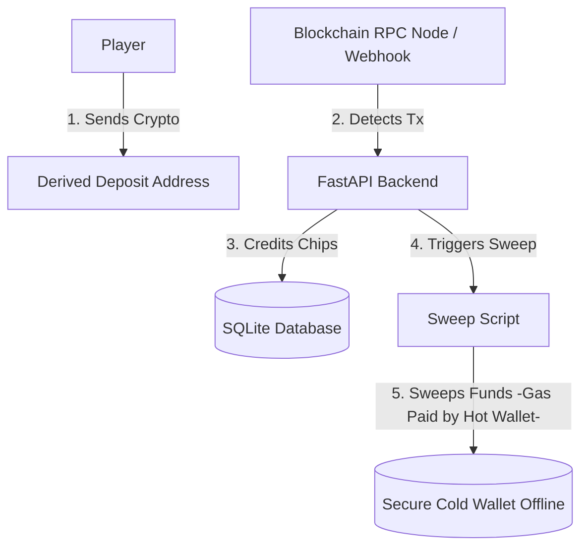

# Production-Level Cryptocurrency Integration Guide

This guide details how to implement a secure, automated, and production-grade cryptocurrency payment gateway for your poker game, including Cold Wallet creation and blockchain transaction verification.

---

## 1. Creating a Secure Cold Wallet (Soğuk Cüzdan)

A cold wallet is a cryptocurrency cüzdan that is kept completely offline, protecting your funds from online hacks. The server should **never** know the private keys or seed phrases of your cold storage.

### Option A: Hardware Wallet (Industry Standard - Recommended)
1. **Purchase**: Buy a hardware wallet directly from official manufacturers like **Ledger (Nano S Plus/Flex)** or **Trezor (Safe 3)**. *Never buy from third-party resellers (e.g., Amazon) to avoid compromised devices.*
2. **Setup**: Plug the device into an offline computer and generate a new wallet.
3. **Backup**: Write down the **24-word recovery phrase (Seed Phrase)** on physical paper (or metal sheets). Store it in a physical safe or deposit box. **Never save it digitally** (no photos, no cloud, no text files).
4. **Copy Public Address**: Copy your public deposit address (Solana address or TRON/USDT address) and paste it into your server configuration. This is the address where funds will be forwarded.

### Option B: Command Line Generator (For Advanced Developers)
You can generate a paper wallet completely offline using the official CLI tools:
- **Solana**: Install the Solana CLI and run `solana-keygen new --outfile ~/my-cold-wallet.json` on an air-gapped machine. Save the public key and keep the JSON file on an encrypted USB drive.

---

## 2. Production Architecture: How Funds Flow

To protect user deposits and ensure automation, you should separate your infrastructure into:
1. **Cold Wallet (Secured)**: Stored offline. Only receives swept funds.
2. **Hot Wallet (Operational)**: Managed by your FastAPI server. It holds small amounts of native coins (SOL/TRX) to pay for gas fees when sweeping user USDT/SOL to the cold wallet.
3. **Derivation (One-time Addresses)**: Generating unique deposit addresses for each transaction.



---

## 3. Automated Blockchain Verification (Production Code)

Instead of simulating verification, a production server checks transactions directly on the blockchain. Below is the Python implementation for verifying Solana and TRON/USDT transactions.

### A. Solana (SOL) Verification Code
This script queries a public Solana RPC node to verify if a transaction hash (signature) successfully sent the required SOL amount to your wallet:

```python
import httpx
import time

SOLANA_RPC_URL = "https://api.mainnet-beta.solana.com"

def verify_solana_transaction(tx_signature: str, target_address: str, expected_sol_amount: float) -> bool:
    payload = {
        "jsonrpc": "2.0",
        "id": 1,
        "method": "getTransaction",
        "params": [
            tx_signature,
            {"encoding": "jsonParsed", "maxSupportedTransactionVersion": 0}
        ]
    }
    
    try:
        # Query Solana RPC Node
        with httpx.Client() as client:
            response = client.post(SOLANA_RPC_URL, json=payload)
            result = response.json().get("result")
            
            if not result:
                return False
            
            # 1. Check if transaction succeeded
            meta = result.get("meta", {})
            if meta.get("err") is not None:
                return False  # Transaction failed
                
            # 2. Check transaction details
            transaction = result.get("transaction", {})
            message = transaction.get("message", {})
            instructions = message.get("instructions", [])
            
            expected_lamports = int(expected_sol_amount * 1_000_000_000)
            
            # 3. Scan instructions for transfer
            for inst in instructions:
                parsed = inst.get("parsed", {})
                info = parsed.get("info", {})
                if parsed.get("type") == "transfer":
                    destination = info.get("destination")
                    lamports = int(info.get("lamports", 0))
                    
                    # Verify destination wallet and amount match
                    if destination == target_address and abs(lamports - expected_lamports) < 1000:
                        return True
                        
    except Exception as e:
        print(f"Error querying Solana RPC: {e}")
        
    return False
```

### B. TRON (USDT TRC-20) Verification Code
For USDT on the TRON network, you can use the TronGrid API to check token transfers targeting your deposit wallet:

```python
import httpx

TRONGRID_API_URL = "https://api.trongrid.io/v1/accounts/{address}/transactions/trc20"

def verify_usdt_trc20_transaction(tx_signature: str, target_address: str, expected_usdt_amount: float) -> bool:
    url = TRONGRID_API_URL.format(address=target_address)
    
    try:
        with httpx.Client() as client:
            response = client.get(url, params={"limit": 20, "only_confirmed": "true"})
            transfers = response.json().get("data", [])
            
            expected_units = int(expected_usdt_amount * 1_000_000) # USDT has 6 decimals
            
            for tx in transfers:
                if tx.get("transaction_id") == tx_signature:
                    # Check target address, token symbol, and amount
                    to_address = tx.get("to")
                    value = int(tx.get("value", 0))
                    symbol = tx.get("token_info", {}).get("symbol")
                    
                    if to_address == target_address and symbol == "USDT" and value >= expected_units:
                        return True
                        
    except Exception as e:
        print(f"Error querying TronGrid: {e}")
        
    return False
```

---

## 4. Payment Gateway Webhook Integrations (Alternative)

Instead of polling RPC nodes manually, you can use third-party services that send a webhook to your FastAPI backend whenever a payment lands in your deposit wallet.

1. **Helius (Solana)**:
   - Configure a webhook on [Helius.dev](https://helius.dev).
   - Set the webhook to monitor your deposit addresses.
   - Helius will trigger a `POST` request to `https://poker-backend.com/api/crypto/webhook` as soon as a payment is confirmed.
2. **Tatum / Moralis (USDT / TRON / EVM)**:
   - Set up custom event monitors.
   - Instantly receive JSON payloads containing tx hash, sender address, and amount.

---

## 5. Security Checklist for Launch

- [ ] **No Private Keys on Server**: Do not store your Cold Wallet's private key or seed phrase in the server's `.env` files.
- [ ] **Transaction Hash Deduplication**: In the database, store all processed transaction signatures (`tx_signature`) with a `UNIQUE` constraint. This prevents **double-spending** (users reusing the same transaction signature to claim chips multiple times).
- [ ] **Rate Limiting**: Apply rate limiting to your `/verify-payment` route to prevent brute-force attacks spamming transaction signatures.
- [ ] **USDT Decimal Check**: USDT uses **6 decimals** on Tron/Solana, while SOL uses **9 decimals**. Ensure your conversion code multiplies values correctly to prevent rounding errors or under-payments.
