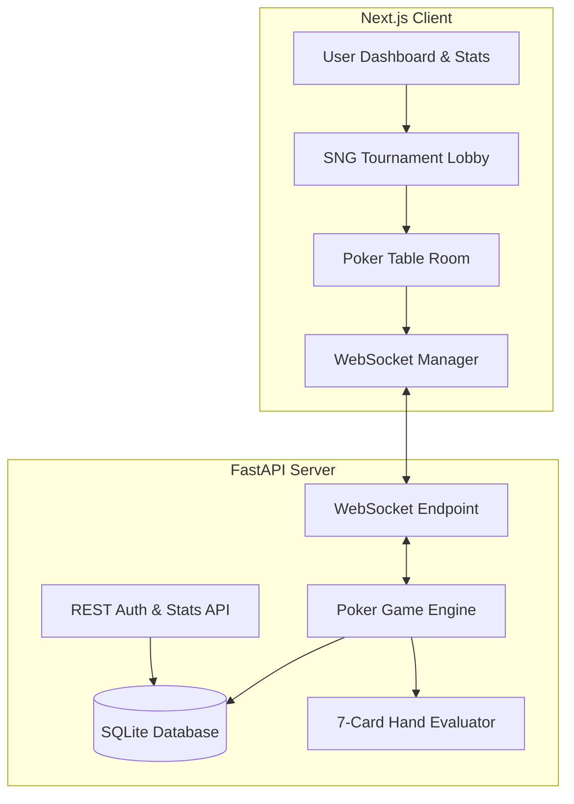

# Implementation Plan - Online Sit & Go Texas Hold'em Poker Game

Build a modern, real-time, web-based Texas Hold'em Poker game focused on a Sit & Go (SNG) tournament format. The stack includes a **FastAPI** backend with **SQLAlchemy/SQLite** and a **Next.js** frontend with a premium dark-themed design and smooth UI interactions.

## User Review Required

> [!IMPORTANT]
> - **Authentication & Stats**: Users will create an account with a starting balance of 10,000 chips. Win rate, total hands/games, and chip balance will be tracked.
> - **Game Format (4-Player Sit & Go)**: 
>   - **No bots** will be used.
>   - A game will only start when exactly **4 players** join the lobby.
>   - Once started, the tournament is locked, and no other players can join.
> - **Buy-in & Rake**:
>   - Each player pays a **1,000 chips** buy-in to join the tournament.
>   - The game/house takes a **10% rake** (100 chips per player).
>   - The total prize pool is **3,600 chips** (4,000 total chips minus 400 rake).
>   - The winner of the tournament takes all **3,600 chips**.
> - **Texas Hold'em Poker Rounds**: Each hand consists of standard rounds:
>   1. **Pre-flop**: Pocket cards dealt, first betting round starting from Under the Gun (UTG).
>   2. **Flop**: 3 community cards dealt, second betting round starting from Small Blind (SB) or first active player.
>   3. **Turn**: 4th community card dealt, third betting round.
>   4. **River**: 5th community card dealt, final betting round.
>   5. **Showdown**: Best 5-card hand evaluated for all remaining active players to determine pot winner(s).
> - **WebSockets**: Real-time gameplay (dealing, betting, actions, blind increases) will be handled via WebSockets for instantaneous state updates.

## Proposed Architecture & Components

---

## Proposed Changes

### Backend Component (FastAPI + SQLAlchemy)

We will set up a Python FastAPI app inside `backend/` containing:
- Authentication system (JWT tokens, bcrypt passwords).
- Models for `User` and `TournamentHistory`.
- A pure-Python 7-card Texas Hold'em hand evaluator.
- A thread-safe/async memory game state manager to handle tournament rooms.
- WebSocket routes for real-time game broadcasts and matchmaking.

#### [NEW] [backend/requirements.txt](file:///c:/Users/h1z1a/Desktop/oyun/backend/requirements.txt)
Python dependency file:
- `fastapi`, `uvicorn`, `websockets`
- `sqlalchemy`, `pydantic`
- `passlib[bcrypt]`, `python-jose[cryptography]`

#### [NEW] [backend/models.py](file:///c:/Users/h1z1a/Desktop/oyun/backend/models.py)
Database schema using SQLAlchemy:
- `User`: `id`, `username`, `email`, `hashed_password`, `chips` (overall bankroll), `games_played`, `games_won`, `hands_played`, `hands_won`, `created_at`.
- `TournamentRecord`: `id`, `buy_in`, `rake`, `prize_pool`, `winner_id`, `created_at`.

#### [NEW] [backend/evaluator.py](file:///c:/Users/h1z1a/Desktop/oyun/backend/evaluator.py)
A robust 7-card hand evaluator:
- Represents cards as rank (2-A) and suit (c, d, h, s).
- Finds the best 5-card combination out of 7 cards.
- Evaluates hand strengths: High Card, One Pair, Two Pair, Three of a Kind, Straight, Flush, Full House, Four of a Kind, Straight Flush, Royal Flush.
- Returns a comparable score (tuple or integer) to determine winners and split pots.

#### [NEW] [backend/poker_logic.py](file:///c:/Users/h1z1a/Desktop/oyun/backend/poker_logic.py)
The core Poker Game Engine:
- `Card`, `Deck`, `Player`, `Pot`, `SidePot`, `GameState`.
- State transitions: `Pre-Flop` -> `Flop` -> `Turn` -> `River` -> `Showdown`.
- Hand dealer, blind scheduler (blinds double every 10 hands), dealer button movement.
- Player actions: `Fold`, `Check`, `Call`, `Bet`, `Raise`, `All-in`.
- Handling multi-way all-ins and creating side pots.
- Connection timeout handling (folding player if they disconnect or time out).

#### [NEW] [backend/main.py](file:///c:/Users/h1z1a/Desktop/oyun/backend/main.py)
FastAPI application file:
- User registration, login, and profile statistics APIs.
- Active tournament room endpoints.
- WebSocket path: `/ws/tournament/{room_id}` for managing real-time connections, syncing game states, and receiving moves.
- Lobby management: waits until exactly 4 players are connected, deducts 1,000 chips from each user (verifying they have enough balance), locks the table, and starts the game.

---

### Frontend Component (Next.js)

We will initialize a Next.js project inside `frontend/` using custom CSS:
- **Design System**: A dark luxury aesthetic (deep dark blues, graphite grays, accents of gold/emerald green).
- **Dashboard**: High-quality user profile, overall statistics, and a "Start Sit & Go" button.
- **Poker Table**: A responsive virtual poker table with:
  - Seat positions (curved layout).
  - Clean card assets (css-based sleek playing cards).
  - Chip count tags, dealer button, blind level overlay.
  - Interactive actions panel: slider for raise amount, quick fold/check/call buttons.
  - Action log (live console of actions: e.g., "Player1 raises to 400", "Player2 calls 400").
  - Sound cues (optional, but visual micro-animations on cards/turn timer are included).

#### [NEW] [frontend/package.json](file:///c:/Users/h1z1a/Desktop/oyun/frontend/package.json)
Next.js dependencies, including icons (`lucide-react`) and style helpers.

#### [NEW] [frontend/app/globals.css](file:///c:/Users/h1z1a/Desktop/oyun/frontend/app/globals.css)
CSS rules featuring:
- Custom luxury dark theme.
- Card slide and flip keyframe animations.
- Radial gradients for the green felt poker table.
- Glassmorphism overlays for UI dialogs.

#### [NEW] [frontend/app/page.tsx](file:///c:/Users/h1z1a/Desktop/oyun/frontend/app/page.tsx)
The landing page and Auth form (Login/Register).

#### [NEW] [frontend/app/dashboard/page.tsx](file:///c:/Users/h1z1a/Desktop/oyun/frontend/app/dashboard/page.tsx)
User stats dashboard showing:
- Chips balance.
- Total games played, games won, win rate %.
- Hand stats (hands won, hands played).
- Buy-in option for Sit & Go (1,000 Chips buy-in).

#### [NEW] [frontend/app/play/[roomId]/page.tsx](file:///c:/Users/h1z1a/Desktop/oyun/frontend/app/play/[roomId]/page.tsx)
The main Sit & Go Table view:
- Renders the felt table layout.
- Places 4 seats depending on configuration.
- Manages WebSocket connection state.
- Dynamic action buttons (Check/Fold, Call, Bet/Raise with a slider).
- Interactive card dealing animations.
- Showdown details showing the winning hand classification.

---

## Verification Plan

### Automated Tests
- Run Python unit tests for the hand evaluator (checking all hand rankings: Royal Flush down to High Card).
- Run Python tests for the game state transitions and pot distribution.

### Manual Verification
1. Start the FastAPI server locally.
2. Launch the Next.js development server.
3. Open 4 different browser windows (or 4 private tabs) and create 4 distinct users.
4. Join the same Sit & Go room using each of the 4 accounts.
5. Verify that the game only starts once the 4th player joins.
6. Verify that chip balances are deducted by 1,000, and a tournament is created with a 3,600 prize pool (10% rake taken).
7. Play a full game, verify that turns rotate, folds/checks/raises work, and when a player wins, they get 3,600 chips and stats are updated.
